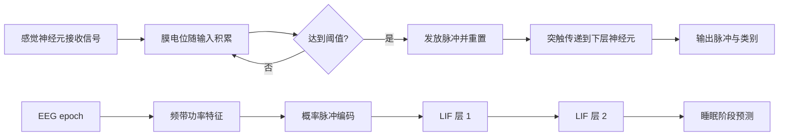

# 基于脉冲神经网络的 EEG 睡眠分期与动力学分析

本仓库搭建一个可复现的 SNN 信号分类项目：从公开 EEG 数据出发，完成预处理、脉冲编码、脉冲神经网络训练、传统基线对比，并分析网络的脉冲活动。

## 项目范围

- **首个 MVP：** 使用 PhysioNet Sleep-EDF 的 EEG 记录，将每个 30 秒 epoch 分类为 Wake、N1、N2、N3 或 REM。
- **数据入口：** 通过 MNE-Python 下载和读取 Sleep-EDF；数据集选择封装在适配函数中，后续可替换为 OpenNeuro 数据。
- **OpenNeuro 后续方向：** 用户偏好的听觉/嗅觉任务保留为下一阶段目标。开始该阶段前，需要核实具体数据集 ID、事件标注、许可和可用通道；本仓库不预先猜测数据集 ID。
- **模型：** snnTorch 两层 LIF 网络，与 SVM、普通 MLP 对照。
- **动力学：** 记录各层脉冲率、脉冲稀疏度和示例脉冲栅格图。

Sleep-EDF 是这里采用的低门槛起步数据，不属于 OpenNeuro。先以睡眠分期打通数据到评估的完整路径，再将同一接口扩展到听觉/嗅觉任务，能避免在数据集尚未核实前把项目建立在错误的事件标签假设上。

## 生物启发与算法流程



生物机制提供的是计算启发：输入驱动膜电位累积，超过阈值时产生离散脉冲，随后膜电位复位；软件中的 LIF 单元用可微近似梯度训练。它不是对完整生物神经系统的模拟。

## 项目结构

```text
.
├── README.md
├── requirements.txt
├── notebooks/
│   └── 01_sleep_edf_snn.ipynb
└── src/
	└── snn_eeg/
		├── __init__.py
		├── data.py
		├── encoding.py
		├── models.py
		├── baselines.py
		└── metrics.py
```

## 交付清单

1. **数据与预处理：** MNE 下载/读取、EEG 通道选择、0.3-35 Hz 带通滤波（抑制通带外工频成分）、按睡眠标注切分 30 秒 epoch，并通过可配置的峰峰值阈值剔除明显振幅伪迹。
2. **特征与编码：** 计算 epoch 的频带功率，将标准化特征映射为多个时间步上的 Bernoulli 脉冲输入。
3. **模型：** 两层全连接 LIF SNN；输出类别脉冲计数，并保存可分析的逐步脉冲。
4. **对照实验：** 在相同受试者划分和特征上评估 SVM、MLP、SNN；至少报告 Accuracy、Macro-F1 和混淆矩阵。
5. **动力学分析：** 绘制输入/隐藏层脉冲栅格图，统计平均发放率、零脉冲比例和总脉冲数。
6. **能耗讨论：** 报告脉冲数或 `synaptic operations` 作为活动量代理，并注明它不是实测焦耳数；若无硬件/功耗测量工具，不将其表述为真实能耗优势。
7. **Notebook：** 按数据、预处理、编码、模型、对照评估、动力学分析组织实验，并记录随机种子、数据划分和关键参数。

## 环境准备

建议 Python 3.10 或 3.11。依赖清单见 [`requirements.txt`](requirements.txt)。安装后从仓库根目录启动 Jupyter，并将 `src` 加入导入路径（Notebook 已预留设置单元）：

```bash
python -m venv .venv
source .venv/bin/activate
python -m pip install -r requirements.txt
python -m pip install -e .
jupyter lab
```

目前仓库处于脚手架阶段；Notebook 中的数据下载和训练单元需要在本地配置依赖后执行。首次运行会下载公开数据，请预留磁盘空间和网络访问。

## 实验约定

- 按受试者划分训练/测试集，避免同一人的 epoch 同时进入两侧造成泄漏；划分方案和随机种子写入结果。
- SVM、MLP、SNN 使用同一份训练/测试样本与同一组输入特征。归一化参数只在训练集上拟合。
- 睡眠阶段类别可能不均衡，因此 Macro-F1 和逐类召回率与 Accuracy 一并报告。
- 先用小规模受试者子集完成流程，再扩大实验；不得把示例子集结果包装成完整数据集结论。
- SNN 与 ANN 的能耗比较需控制硬件、精度、批量和工作量。软件层面的脉冲计数只能作为活动量代理。

## 运行入口

打开 [`notebooks/01_sleep_edf_snn.ipynb`](notebooks/01_sleep_edf_snn.ipynb)，从上到下执行。当前 Notebook 是实验骨架，包含待补齐/运行的步骤说明，不代表已经训练出结果。
