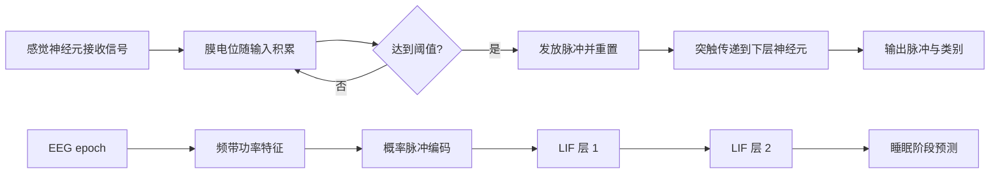

# 基于脉冲神经网络的 EEG 睡眠分期与动力学分析

本仓库搭建一个可复现的 SNN 信号分类项目：从公开 EEG 数据出发，完成预处理、脉冲编码、脉冲神经网络训练、传统基线对比，并分析网络的脉冲活动。

## 项目范围

- **首个 MVP：** 使用 PhysioNet Sleep-EDF 的 EEG 记录，将每个 30 秒 epoch 分类为 Wake、N1、N2、N3 或 REM。
- **数据入口：** 通过 MNE-Python 下载和读取 Sleep-EDF；数据集选择封装在适配函数中，后续可替换为 OpenNeuro 数据。
- **OpenNeuro 听觉阶段：** 在单独的实验中使用 OpenNeuro `ds006480`，依据数据集 README 中核实的事件码区分被动对照任务中的标准音（106）和目标音（107）。
- **OpenNeuro 嗅觉方向：** 作为后续候选保留；目前没有选定数据集。本项目不根据关键词搜索失败就推断 OpenNeuro 不存在嗅觉数据，开始实验前仍需逐项核实数据集 ID、任务和气味事件标注、许可及可用通道。
- **模型：** snnTorch 两层 LIF 网络，与 SVM、普通 MLP 对照。
- **动力学：** 记录各层脉冲率、脉冲稀疏度和示例脉冲栅格图。

Sleep-EDF 是这里采用的低门槛起步数据，不属于 OpenNeuro。听觉实验与睡眠分期实验分开放在不同 Notebook 中，因为它们有不同任务、文件格式、标签和切分方法；这样更容易逐步学习和比较，也避免把一种数据的假设错误地用于另一种数据。

## EEG 分析与 SNN：区别、优势与局限

EEG 是连续测量到的电压信号，而 SNN 是处理信息的一类神经网络。两者并不是相互替代的预处理方法：EEG 实验通常仍需选通道、滤波、切段、控制伪迹和评估数据泄漏；SNN 是在这些数据准备步骤之后，另一种建模方式。

- **睡眠 Notebook 的传统输入：** 30 秒 EEG 被压缩成 5 个频带功率特征，再由 SVM/MLP 或 SNN 分类。其 SNN 输入脉冲是对这些汇总特征的随机率编码；原 EEG 波形的精细时间顺序已在特征计算时丢失。因此该实验不等于直接将原始 EEG 的时间波形送进 SNN。
- **听觉 Notebook 的时序输入：** 根据事件标记截取标准音/目标音附近的 EEG，标准化后将每个真实时间点的振幅映射为脉冲概率。SNN 的 LIF 膜状态随 epoch 时间步变化，输入保留声音事件前后的时间顺序，但脉冲仍是软件对数字信号的编码，不是记录到的神经元脉冲。
- **潜在优势：** SNN 可显式描述离散事件和随时间演变的内部状态；稀疏脉冲计算与特定神经形态硬件结合时，可能有利于低延迟或低功耗应用。时序建模、事件驱动和硬件效率是研究方向，不是对任意 EEG 任务都已成立的优势。
- **局限：** 脉冲编码会带来设计选择和随机性；阈值脉冲不可直接求普通梯度，训练通常依赖替代梯度等近似。性能容易受预处理、类别比例、被试划分和比较基线影响。软件中的脉冲数量、稀疏度或运算估算本身不能证明真实能耗更低；能耗结论需要明确硬件、任务、精度和测量方法。

### SNN 与 EEG 的近期研究线索

下面列出可作为继续阅读的论文，而不是对当前小型 Notebook 结果的证明。新论文应结合原文数据集、代码、被试划分和硬件实验来评估。

- **2023，EEG-SNN 架构：** Gong 等提出 SGLNet，将可学习脉冲编码、自适应图卷积和脉冲 LSTM 用于 EEG 脑机接口任务，在情绪识别和运动想象数据上评估。它展示了把电极空间关系与时间动态纳入 SNN 的一种研究路线，不是本仓库听觉任务的直接验证。[论文 DOI: 10.1109/TNSRE.2023.3246989](https://doi.org/10.1109/TNSRE.2023.3246989)
- **2024 卷期，听觉注意：** Cai、Li 和 Li 的 BSAnet 将脉冲网络与注意机制用于听觉注意 EEG 研究，涉及公共听觉注意数据。任务是注意选择，不应与本项目的标准音/目标音分类混为一谈。[论文 DOI: 10.1109/TNNLS.2023.3303308](https://doi.org/10.1109/TNNLS.2023.3303308)
- **2025，时频与注意力：** Yuan、Wei 和 Liu 的 SpikeWavformer 探索将小波时频分解与脉冲自注意力结合，用于 EEG 信号分析，包含情绪识别和听觉注意实验。论文提出的效率动机不能直接当作真实硬件节能测量。[论文 DOI: 10.3389/fnins.2025.1652274](https://doi.org/10.3389/fnins.2025.1652274)
- **2026 卷期的综述：** Cai 等系统回顾 EEG 脉冲神经网络从理论到实践的研究，可用来跟踪编码、训练和任务方向。综述覆盖不等于其中每种方法都已达到临床或硬件部署成熟度。[论文 DOI: 10.1016/j.neunet.2025.108127](https://doi.org/10.1016/j.neunet.2025.108127)
- **更广的生理信号综述：** Park 和 Choi 回顾 SNN 在生理与语音信号中的方法和应用，适合作为 EEG 专题综述的补充。[论文 DOI: 10.1007/s13534-024-00404-0](https://doi.org/10.1007/s13534-024-00404-0)

## 生物启发与算法流程



生物机制提供的是计算启发：输入驱动膜电位累积，超过阈值时产生离散脉冲，随后膜电位复位；软件中的 LIF 单元用可微近似梯度训练。它不是对完整生物神经系统的模拟。

## 项目结构

```text
.
├── README.md
├── requirements.txt
├── notebooks/
│   ├── 01_sleep_edf_snn.ipynb
│   └── 02_openneuro_auditory_snn.ipynb
└── src/
	└── snn_eeg/
		├── __init__.py
		├── data.py
		├── encoding.py
		├── models.py
		├── baselines.py
		└── metrics.py
```

## 交付清单

1. **数据与预处理：** MNE 下载/读取、EEG 通道选择、0.3-35 Hz 带通滤波（抑制通带外工频成分）、按睡眠标注切分 30 秒 epoch，并通过可配置的峰峰值阈值剔除明显振幅伪迹。
2. **特征与编码：** 计算 epoch 的频带功率，将标准化特征映射为多个时间步上的 Bernoulli 脉冲输入。
3. **模型：** 两层全连接 LIF SNN；输出类别脉冲计数，并保存可分析的逐步脉冲。
4. **对照实验：** 在相同受试者划分和特征上评估 SVM、MLP、SNN；至少报告 Accuracy、Macro-F1 和混淆矩阵。
5. **动力学分析：** 绘制输入/隐藏层脉冲栅格图，统计平均发放率、零脉冲比例和总脉冲数。
6. **能耗讨论：** 报告脉冲数或 `synaptic operations` 作为活动量代理，并注明它不是实测焦耳数；若无硬件/功耗测量工具，不将其表述为真实能耗优势。
7. **Notebook：** 按数据、预处理、编码、模型、对照评估、动力学分析组织实验，并记录随机种子、数据划分和关键参数。

## 环境准备

建议 Python 3.10 或 3.11。依赖清单见 [`requirements.txt`](requirements.txt)。安装后从仓库根目录启动 Jupyter，并将 `src` 加入导入路径（Notebook 已预留设置单元）：

```bash
python -m venv .venv
source .venv/bin/activate
python -m pip install -r requirements.txt
python -m pip install -e .
jupyter lab
```

目前仓库处于脚手架阶段；Notebook 中的数据下载和训练单元需要在本地配置依赖后执行。首次运行会下载公开数据，请预留磁盘空间和网络访问。

## 实验约定

- 按受试者划分训练/测试集，避免同一人的 epoch 同时进入两侧造成泄漏；划分方案和随机种子写入结果。
- SVM、MLP、SNN 使用同一份训练/测试样本与同一组输入特征。归一化参数只在训练集上拟合。
- 睡眠阶段类别可能不均衡，因此 Macro-F1 和逐类召回率与 Accuracy 一并报告。
- 先用小规模受试者子集完成流程，再扩大实验；不得把示例子集结果包装成完整数据集结论。
- SNN 与 ANN 的能耗比较需控制硬件、精度、批量和工作量。软件层面的脉冲计数只能作为活动量代理。

## 运行入口

1. 打开 [`notebooks/01_sleep_edf_snn.ipynb`](notebooks/01_sleep_edf_snn.ipynb)，从上到下执行，学习 Sleep-EDF 睡眠分期和频带特征基线。
2. 打开 [`notebooks/02_openneuro_auditory_snn.ipynb`](notebooks/02_openneuro_auditory_snn.ipynb)，学习 OpenNeuro 听觉事件分类。首次运行前请读 Notebook 中的数据说明：只选择一位受试者的原始 EEG 文件，但文件仍约 1 GB；只有确认可用磁盘空间并愿意下载时才开启代码中的 `DOWNLOAD_EEG` 开关。

OpenNeuro 实验选择数据集 `ds006480` snapshot `1.0.1` 的被动控制条件，标记映射以该数据集的 [README](https://github.com/OpenNeuroDatasets/ds006480/blob/069fe5fe24ec3004e98304c5abb1442bb2d7420a/README) 为准。这个学习版按单个受试者早/晚时段划分训练与测试；不能将其结果解释为跨受试者泛化。数据集论文/预印本和许可信息可见 [dataset_description.json](https://github.com/OpenNeuroDatasets/ds006480/blob/069fe5fe24ec3004e98304c5abb1442bb2d7420a/dataset_description.json)。
